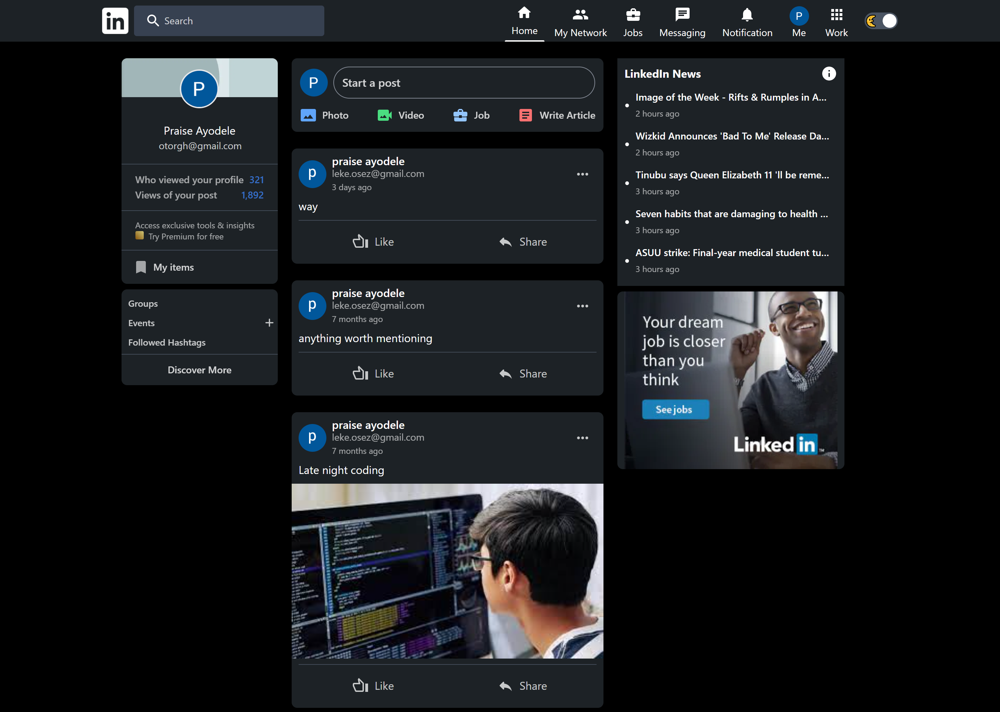

# LinkedIn Clone

  

## SEE DEMO VIA THIS LINK
https://linkedin-beta-six.vercel.app/

## DESCRIPTION
This app was built to implement linkedIn UI with little backend features
The linkedin clone was built with: __NextJS__, MongoDB __TailwindCSS.
It leverages on NextJS simplicity .

NextJS handles all the client-side functionalities like:
State Management, UI rendering,routing, Caching and so on.

NextJS also handles the server-side developments, such as:
Authentication,Server Side Rendering(SSR), CRUD operations,routing, Storage etc. basically all operations you would normally do on the backend which is super-awesome!!!

## FEATURES
- Authentication (Sign in and Sign up) with email and password.
- Post creation and deletion.
- Like a post feature
- Profile update - set profile picture, bio and name 
- Settings feature - set theme mode (dark or light),

## INSTALLATION GUIDE
1. Go ahead and clone this repo to your local machine.
2. Make sure you have node installed.
3. On your command line type and run `npm install` to install all dependencies.
4. This project uses some environment variables so create a __.env__ file
5. When done creating your .env file, you environment variables would contain your Firebase configurations
   Create a new project on Firebase, the instruction for that is out of the scope of this, but the instrucitons firebase gives in the doc is pretty easy.
6. Now in your __.env__ file; ADD the following variables  
   __GOOGLE_CLIENT_ID__ is your Google ClientId  
   __GOOGLE_CLIENT_ID__ is your Google Client Secret 
   __MONGODB_URL__ is your MongoDB URL  
   __MONGODB_DB__ is your MongoDB name  
   __JWT_SECRET__ is your unique generated key  
   __NEXTAUTH_URL__ is your index page, if using your local machine set it to the URL and PORT your Next server is currently on.
7. now RUN `npm run dev`

That is all you need to run the project 

   

